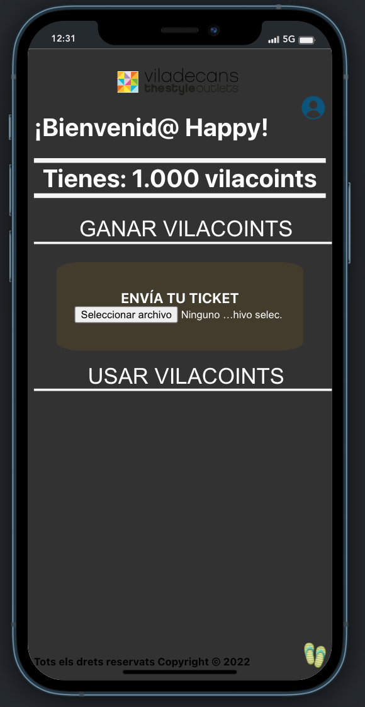

# HAPPY STYLE - VILADEHACK TOURISM.

    En este startup, pretende dar diferentes soluciones a los retos que nos han presentado.

    Solución para reubicar el turismo y avivar el consumo en Viladecans:

- Es una aplicación gratuita para el usuario. Él nos va a facilitar cierta información. SEgún esos datos vamos a poderle proporcionar unos descuentos y privilegios personalizados. Todo esto estará gestionado conuna moneda propio. Cuantos más tickets ingreses más monedas obtendras. Esas monedas són las que podrás canjear para obtener los descuentos y privilegios.

- Para iniciar:
  npm install react-scripts@latest
  npm install axios

## visualizaciónes:

